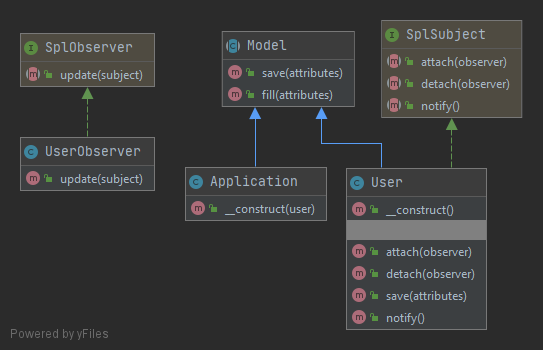

# Наблюдатель (Observer)

Наблюдатель - поведенческий паттерн проектирования, который создаёт механизм подписки,
позволяющий одним объектам следить и реагировать на события, происходящие в других объектах.

### Пример
Пример содержит следующие основные классы:
 - `User` - класс-субъект, подлежащий наблюдению и реализующий метод `notify`, уведомляющий наблюдателей об изменениях.
 - `UserObserver` - класс-наблюдатель, который имплементирует метод `update`, реализующий логику обработки изменений в `User`.
 - `Application` - класс, создаваемый наблюдателем, при изменении класса `User`. 

### Тест
[Тест](../../../tests/ObserverTest.php)

