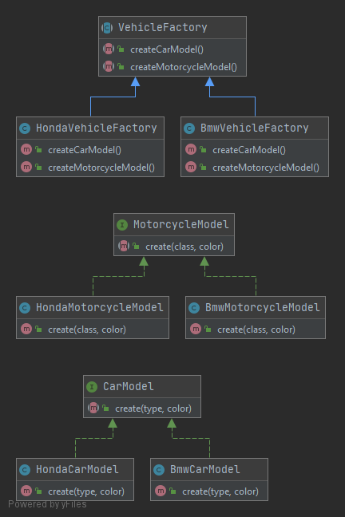

# Абстрактная фабрика (Abstract Factory)

Абстрактная фабрика позволяет создавать классы для связанных объектов без указания конкретного класса фабрики. 
Основная идея паттерна заключается в том, что мы можем передать клиентскому классу фабрику с определённым интерфейсом,
и клиент будет работать с "интерфейсными" методами фабрики. Это позволяет изменять при необходимости класс фабрики для
создания сущностей другой разновидности.

### Пример
В данном примере реализованы фабрики для создания транспортных средств разных марок.

### Тест
[Тест](../../../tests/AbstractFactoryTest.php)
