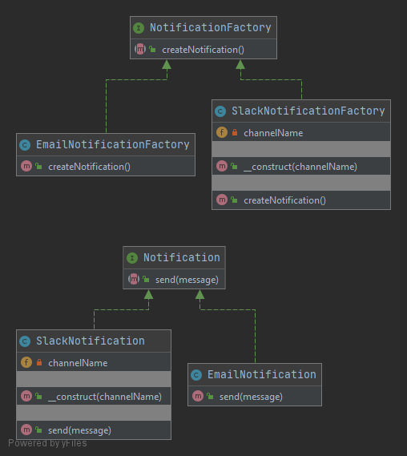

# Фабричный метод (Factory Method)

Паттерн фабричный метод предполагает наличие у фабрики подклассов, в которых переопределяется класс создаваемого объекта.

### Пример
В данном примере реализованы фабрики для создания классов уведомлений.

### Тест
[Тест](../../../tests/FactoryMethodTest.php)
