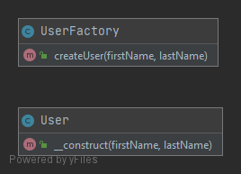

# Простая фабрика (Simple Factory)

Простая фабрика содержит один метод для создания  класса; позволяет передавать параметры в конструктор создаваемого класса.
Метод создания объектов может содержать условный оператор для выбора создаваемого класса. 

### Пример
В данном примере реализована фабрика `UserFactory` для создания инстансов класса `User`.

### Тест
[Тест](../../../tests/SimpleFactoryTest.php)
