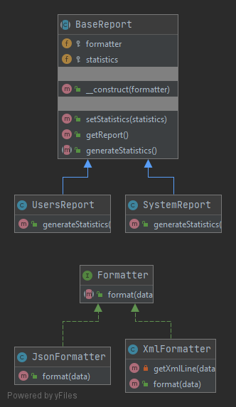

# Мост (Bridge)

Структурный паттерн проектирования, который разделяет один или несколько классов на  две отдельные иерархии - 
абстракцию и реализацию, что позволяет изменять их независимо друг от друга. 
Реализация - это слой, который отвечает за работу основной логики.
Абстракция (или интерфейс) - образный слой, который делегирует работу слою реализации.
Например, абстракция решает задачу представления данных в нужном формате, в то время как реализация формирует данные.

### Пример
Для данного примера реализованы классы генерации статистики в различных форматах.
Реализацией, то есть слоем с основной логикой являются классы-репортеры, которые генерируют статистику.
Абстракцией являются классы-форматтеры, которые приводят статистику к нужному виду - XML или JSON. 

### Тест
[Тест](../../../tests/BridgeTest.php)
