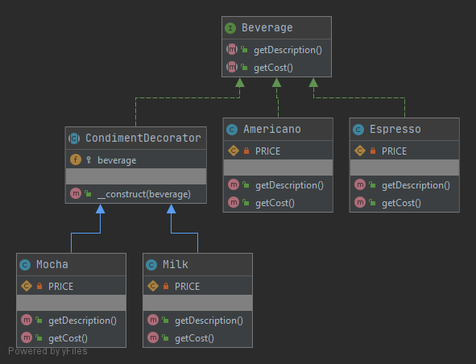

# Decorator (декоратор)

Декоратор - структурный паттерн. Декоратор оборачивает класс и добавляет новую функциональность.
Декоратор реализует тот же интерфейс, что и оборачиваемый класс.

### Пример
В данном примере реализован декоратор добавок к кофе - `CondimentDecorator`.

### Тест
[Тест](../../../tests/DecoratorTest.php)
